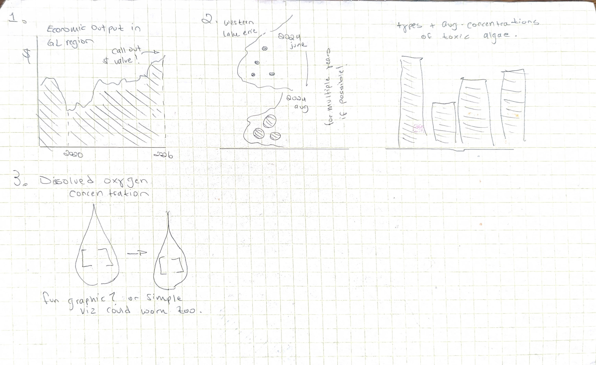

| [home page](https://cmustudent.github.io/tswd-portfolio-templates/) | [data viz examples](dataviz-examples) | [critique by design](critique-by-design) | [final project I](final-project-part-one) | [final project II](final-project-part-two) | [final project III](final-project-part-three) |

> Important note: this template includes major elements of Part I, but the instructions on Canvas are the authoritative source.  Make sure to read through the assignment page and review the rubric to confirm you have everything you need before submitting.  When done, delete these instructions before submitting.

# Outline
> Include a high-level summary of your project.  This should be a couple paragraphs that describe what you're interested in showing with your final project. 
 
The Great Lakes are an underappreciated region of the United States. These large freshwater lakes are home to diverse and endangered ecosystems, like marshes and wetlands. Growing up, I would visit Sterling State Park in Monroe, MI, about an hour south of Detroit. My family could escape to the beach and relax in the sun and (modest) waves. However, the beach deteriorated in the past ten years. Algae blooms grew offshore, the water quality decreased substantially, and dead fish floated onto the shore. The smell of fresh air was replaced by stinking, rotten fish. While I can complain about the smell, these conditions mostly worried me about the fragile wetlands protected in Sterling State Park, just inland of the beach. 

In this project, I plan to document Great Lakes algae blooms using data visualization. The project will address farmers, who are landowners (stakeholders) in the region and contribute the most to algal blooms. Fertilizer from farms adds nitrogen to the water, which fuels algae growth and eats away at oxygen concentrations in the water. A main challenge of this project will be framing of the problem-- I cannot directly blame farmers for the fertilizer runoff they add to the ecosystem. This would likely make them unresponsive to the story I will tell. So, I will create visualizations of time-series data that shows increasing algae, show the economic benefit the Lakes have for our region, and implore them to adapt new agricultural techniques that protect the ecosystem. Lake Erie will be used as a "case study": what will happen at other lakes if the concentration of fertilizer reaches the levels seen in Lake Erie? Farmers need to be aware of the impacts of fertilizer, but not blamed for trying to make a living in a competitive industry. 

#### Thesis: 

 Human activities birth algae blooms that endanger humans and choke out ecosystems along the Great Lakes.

#### Call to action/ tagline: 
Protect our HOMES (abbreviation for lakes Huron, Ontario, Michigan, Erie, and Superior)

#### Reader Perspective

As a reader, I want to understand algae growth caused by human intervention so that I can protect local ecosystems and reduce harm to humans and animals. 

I can do this by adapting new agricultural techniques that limit nitrogen entering the water supply. 

#### Story Arc Overview:
1. Create emotional ties to Great Lakes: visualization of economic output of the region, include my own photos of the lakes.
2. Negative impacts of algae coverage: start with my own photos of green water at Lake Erie. Then, add visualization of algae coverage / growth of bloom over time, toxic algae concentration in 2024. 
3. Why does this happen?: visualization of dissolved oxygen-- I cannot access data about nitrogen concentration directly, so I will use dissolved oxygen (DO) concentration as a proxy. DO will decrease as nitrogen concentration increases (algae blooms, fueled by nitrogen, eat away at oxygen in water).
4. What can we do?: No visualizations, research nitrogen-free farming practices.

## Initial sketches
> Post images of your anticipated data visualizations (sketches are fine). They should mimic aspects of your outline, and include elements of your story.  

# The data
> A couple of paragraphs that document your data source(s), and an explanation of how you plan on using your data. 

The data for this project comes from the National Oceanic and Atmospheric Administration and from U.S. Geological Surveys by the Department of the Interior. These two organizations research the Lakes' water quality by collecting water and sediment samples in the Great Lakes. I will use these samples to show the growth of algae over time, how the lakes look today, the presence and count of harmful algae blooms, and the oxygen levels in water / nitrification. Much of this data focuses on Lake Erie, which will benefit my case study. Also, NOAA releases economic output data for communities dependent on water through their Economics: National Ocean Watch datasets. This project will use their sectors dataset to chart tourism and agricultural output along the Lakes. 

> A link to the publicly-accessible datasets you plan on using, or a link to a copy of the data you've uploaded to your Github repository, Box account or other publicly-accessible location. Using a datasource that is already publicly accessible is highly encouraged.  If you anticipate using a data source other than something that would be publicly available please talk to me first. 

| Name | URL | Description |
|------|-----|-------------|
| Potential for microbially mediated nitrogen transformations in benthic algae, sediment, and overlying water in the Great Lakes, NiCE (Nitrogen Cycle Evaluation), 2022 | https://catalog.data.gov/dataset/potential-for-microbially-mediated-nitrogen-transformations-in-benthic-algae-sediment-2022?from_hint=eyJzb3J0IjoicmVsZXZhbmNlIiwicSI6ImFsZ2FlIGdyZWF0IGxha2VzIiwic3BhdGlhbF9maWx0ZXIiOiJnZW9zcGF0aWFsIn0%3D | Water and sediment samples from all Great Lakes in 2022. Good for Erie-specific data AND comparisons across locations. |
| Locations in NiCE |https://catalog.data.gov/dataset/potential-for-microbially-mediated-nitrogen-transformations-in-benthic-algae-sediment-2022?from_hint=eyJzb3J0IjoicmVsZXZhbmNlIiwicSI6ImFsZ2FlIGdyZWF0IGxha2VzIiwic3BhdGlhbF9maWx0ZXIiOiJnZW9zcGF0aWFsIn0%3D| Latitude and Longitude of testing sites in the NiCE.|
| Benthic Algal Community Composition in the Laurentian Great Lakes (2024) |https://catalog.data.gov/dataset/benthic-algal-community-composition-in-the-laurentian-great-lakes-2024?from_hint=eyJxIjoiYWxnYWUgZ3JlYXQgbGFrZXMifQ%3D%3D| Types of Algae present in water, algae coverage. For all lakes. |
| Lake Erie Weekly Field Sampling Data, Current Data| https://www.glerl.noaa.gov/res/HABs_and_Hypoxia/wle-weekly-current/| From the GLERL, Harmful Algae Bloom (HAB) tracking. Lake Erie only!| 
| Lake Erie Environmental Sample Processor (ESP) Data| https://www.glerl.noaa.gov/res/HABs_and_Hypoxia/esp-data/ | measures concentration of Microcystin, one of the worst/most harmful species of algae.| 
| Economics: National Ocean Watch Sectors| https://coast.noaa.gov/digitalcoast/data/enow.html| Need to filter for Great Lakes states, but shows the economic output of different industrial sectors along the lake. Very useful for showing profits to farmers-- how they can support their local economy by increasing tourism.| 

# Method and medium

I will use Tableau and Shorthand to complete this project. I want my analysis to be visible for the public-- everyone should have access to my Shorthand site so farmers can be educated on the benefits of de-nitrification. My end goal is for farmers to share the resource among each other, so the project will need to be digestible and understandable for a non-academic audience. Interactive visualizations may be the most helpful to achieve this goal, thus informing my choice of Tableau. 

## References

Department of the Interior—Benthic Algal Community Composition in the Laurentian Great Lakes. (2024). Data.Gov. Retrieved September 23, 2026, from http://catalog.data.gov/dataset/benthic-algal-community-composition-in-the-laurentian-great-lakes-2024

Department of the Interior—Potential for microbially mediated nitrogen transformations in benthic algae, sediment, and overlying water in the Great Lakes. (2022). Data.Gov. Retrieved September 23, 2026, from http://catalog.data.gov/dataset/potential-for-microbially-mediated-nitrogen-transformations-in-benthic-algae-sediment-2022

Harmful Algal Blooms (HABs) | CIGLR. (n.d.). Retrieved September 23, 2026, from https://ciglr.seas.umich.edu/project/harmful-algal-blooms-habs/

Economics: National Ocean Watch. (n.d.). Retrieved September 23, 2026, from https://coast.noaa.gov/digitalcoast/data/enow.html

US Department of Commerce, N. (2026-a). NOAA-GLERL Western Lake Erie Environmental Sample Processor data. Retrieved September 23, 2026, from https://www.glerl.noaa.gov/res/HABs_and_Hypoxia/esp-data/

US Department of Commerce, N. (2026-b). NOAA-GLERL Western Lake Erie Weekly Field Sampling data. Retrieved September 23, 2026, from https://www.glerl.noaa.gov/res/HABs_and_Hypoxia/wle-weekly-current/

## AI acknowledgements
No Artificial Intelligence (AI) was used in the research or writing of this assignment. 
